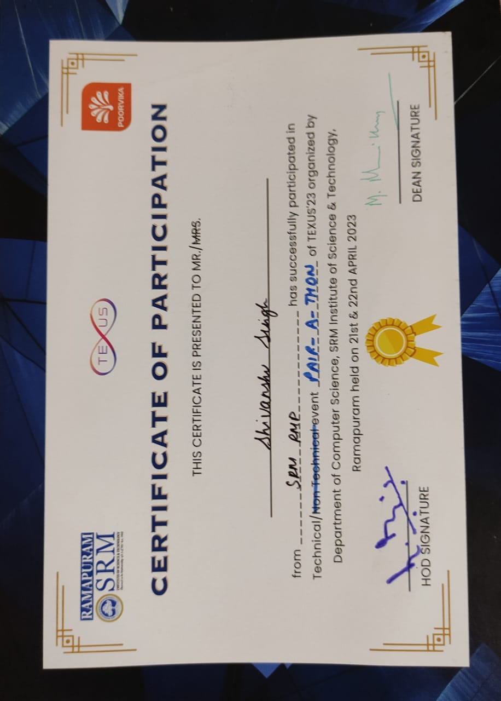

PAIR-A-THON 
heald on 21st and 22nd April 2023

<h1>College ERP: Leave and OD Management</h1>

Description
The College ERP: Leave and OD Management system is a comprehensive web-based application designed to streamline and automate the process of managing leave requests and On Duty (OD) applications for students and faculty members within a college or educational institution. The system aims to simplify administrative tasks, improve communication, and enhance overall efficiency in handling leave-related processes.
This project totaly based on frontend.

## ScreenShots
<video src="ERP.mp4" width="400px" height="400px"> 
</video>

## Team Members

### Shivanshu Singh
- **Role:** Frontend Developer / UI/UX Designer
- **Responsibilities:** Coordination of tasks, scheduling, and overall project management. Writing HTML, CSS, and JavaScript code.
### Certificate

### Sajal Arya
- **Role:** Frontend Developer
- **Responsibilities:** Helping me for ensuring the website's responsiveness and interactivity.

## Installation

1. Clone the repository:

2. Navigate to the project directory:

3. Open the `index.html` file in your web browser.

## Usage

Simply open the `index.html` file in any modern web browser to view the webpage. The webpage should display correctly and respond to interactions.

## Contributing

Contributions are welcome! Here's how you can contribute to this project:

1. Fork the project.
2. Create your feature branch (`git checkout -b feature/YourFeature`).
3. Commit your changes (`git commit -am 'Add some feature'`).
4. Push to the branch (`git push origin feature/YourFeature`).
5. Create a new Pull Request.

Please make sure to follow the code style and conventions used in the project.

## License

This project is licensed under the MIT License - see the [LICENSE](LICENSE) file for details.
